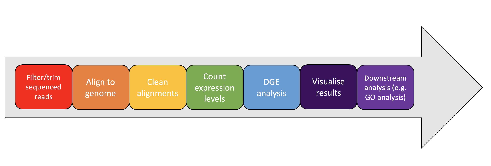
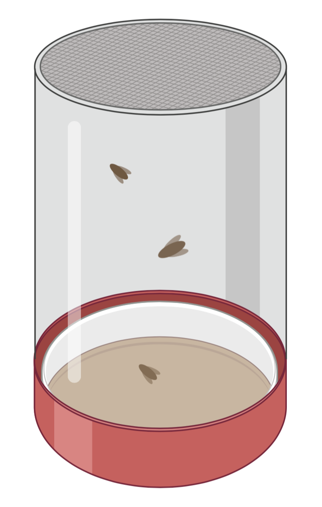
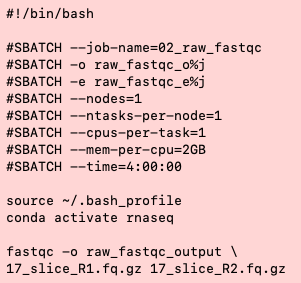
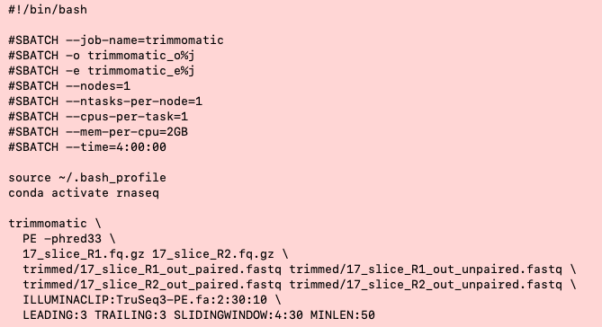
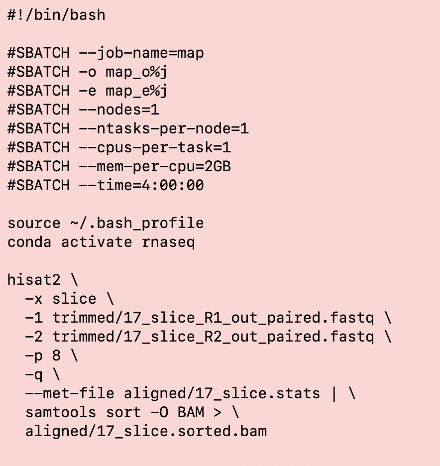
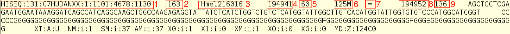
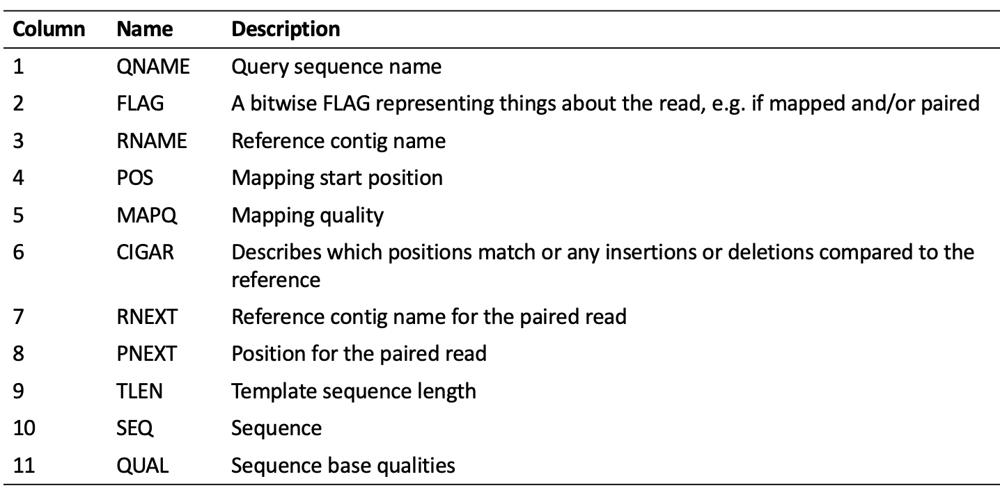
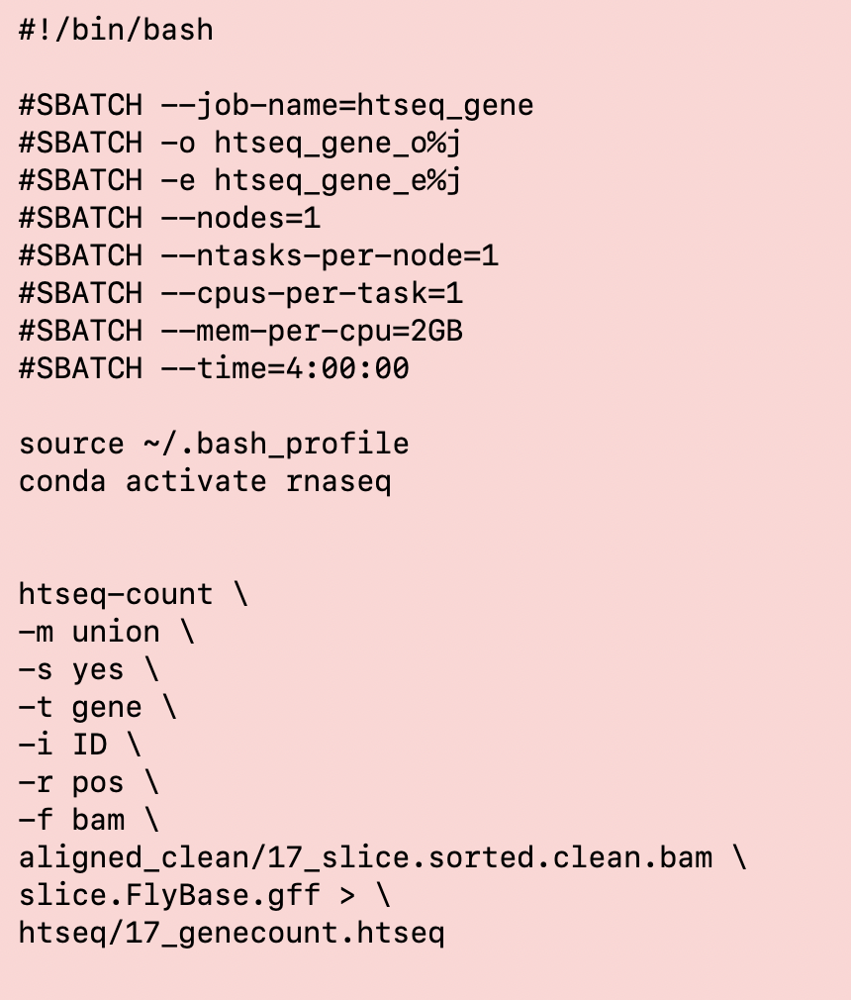

<br>
<br>
# RNA-seq pipeline workshop for Stanage
<br>
<font size="4">

## Introduction

<details>
<summary>

### 1) Credits

</summary>
 
  Compiled by: Helen Hipperson, University of Sheffield<br>
 
  This tutorial is set up to introduce the analysis of RNAseq data in the context of examining differential 
  expression, using standard tools, as introduced in the NEOF RNAseq, Differential Gene Expression and 
  Pathway Analysis workshop. Details of the workshop can be found [here](https://neof.org.uk/training/). 

  This closely follows the approach and workflow developed for the above workshop by Katy Maher, Helen 
  Hipperson, Ewan Harney, Steve Paterson, Bert Overduin, Matthew Gemmell and Xuan Liu. It also relies substantially 
  on scripts developed by Katy Maher. Use and referencing of this repository implicitly acknowledges these contributions.
</details>


<details>
<summary>

### 2) Introduction

</summary>
  
  
  
RNA-Seq (AKA whole transcriptomic shotgun sequencing) aims to determine the presence and quantity of RNA in a biological sample at a given moment in time. This allows you to determine the level of expression of these genes and therefore compare these expressions across different sample groups, i.e. Differential Gene Expression (DGE). 

Sessions will start with a brief presentation followed by self-paced computer practicals guided by an online interactive book. The book will contain theory and practice code. Multiple choice questions will guide the interpretation of results.

At the end of the course learners will be able to:

- Quality control Illumina RNA-seq data.
- Map RNA-seq data to a prepared reference transcriptome.
- Visualise the mapping with IGV.
- Count the number of reads per gene and exon with htseq.
- Carry out differential gene expression analysis (DGE) with DESeq2.
- Visualise DGE results via MA plots, volcano plots, heatmaps, and PCA plots.
- Carry out Gene Ontology enrichment analysis.

<p align="center">
  
</p>

Analyses of differential gene expression (DGE) tend to follow a similar pattern to the above image. There are variations on this pattern.  For instance, if no genes have been annotated in the reference genome these can be annotated using the RNA-seq reads as a guide.  If no reference genome has been sequenced, it may be possible to assemble RNA-seq reads directly, but this is very computationally intensive. We will not be assembling de-novo transcriptomes in this workshop, instead we will map our reads to an assembled genome.


<p align="center">
  
</p>
  
We will carry out a differential gene expression analysis of a subset of [_Drosophila pseudoobscura_](http://en.wikipedia.org/wiki/Drosophila_pseudoobscura) samples from a sexual selection experiment, following the above workflow.


  This tutorial has been written for use with the University of Sheffield's
  [Stanage](https://docs.hpc.shef.ac.uk/en/latest/stanage/index.html#gsc.tab=0) high-performance computing (HPC) 
  system, but should be applicable to any GNU/Linux-based HPC system, with appropriate environments, software 
  installations and modification. Your mileage may vary.

  Code which the user (that's you) must run is highlighted in a code block like this:
  ```
  I am code - you must run me
  ```
  Sometimes the desired output from a command or additional information about the command is included in the code
  block as a comment.
  
  For example:
  ```
  Running this command
  # Should produce this output
  ```

  File-paths within normal text are within single quote marks, like this:

  '/home/user/a_file_path'
  
 Contact: Helen Hipperson //  h.hipperson@sheffield.ac.uk
</details>


<details>
<summary>

### 3) Getting started on the HPC

</summary>

<p align="center">
  
</p>


<details>
<summary>

#### 3.1) Access the HPC

 </summary>
 
	
  To access the Stanage HPC you must be connected securely to the university network - this can 
  be achieved remotely by using the virtual private network (VPN) service.

  Please see the university IT pages for details on how to [connect to the VPN](https://students.sheffield.ac.uk/it-services/vpn).

  Once connected to the VPN you also need to connect to the HPC using a secure shell (SSH)
  connection. This can be achieved using the command line on your system (the Mac Terminal or Windows 
  PowerShell) or a software package such as [MobaXterm](https://mobaxterm.mobatek.net/).
</details>
  
  
  <details>
  <summary>

#### 3.2) Access a worker node on Stanage

 </summary>
 
  
  Once you have successfully logged into Stanage, you need to access a worker node:

  ```
  srun --pty bash -l
  ```
  You should see that the command prompt has changed from

  ```
  [<user>@login1 [stanage] ~]$
  ```
  to
  ```
  [<user>@node001 [stanage] ~]$
  ```
  ...where \<user\> is your University of Sheffield (UoS) IT username.
</details>
  
  
   <details>
  <summary>
  
#### 3.3) Load the Genomics Software Repository

</summary>
  
  
  The Genomics Software Repository contains several pre-loaded pieces of software
  and environments useful for a range of genomic analyses, including this one.
  
  Type:
  
  ```
  source ~/.bash_profile
  ```
  
  Did you receive the following message when you accessed the worker node?
  
  ```
  Your account is set up to use the Genomics Software Repository
  ```

  If so, you are set up and do not need to do the following step.
  
  If not, enter the following:
  
  ```
  echo -e "if [[ -e '/mnt/community/Genomics' ]];\nthen\n\tsource /mnt/community/Genomics/.bashrc\nfi" >>
$HOME/.bash_profile
  ```
  Then re-load your profile:
  
  ```
  source ~/.bash_profile
  ```
  
  Upon re-loading, you should see the above message relating to the Genomics Software Repository.
</details>
  
  
   <details>
  <summary>
  
#### 3.4) Set up your conda profile
 
 
 </summary>
  
  
  If you have never run conda before on Stanage, you might have to initialise your conda. To do this type:
  
  ```
  conda init bash
  ```
  
  You will then be asked to reopen your current shell. Log out and then back into Stanage and then continue. 
</details>
  
  
  
  
   <details>
  <summary>
  
#### 3.5) Running scripts on the HPC cluster

 </summary>
  
  
  To add our job to the job scheduler, we would submit the shell scripts using 'sbatch'
  (don't do this; it's simply an example).

  ```
  ## EXAMPLE - DON'T RUN
  sbatch scripts/example_script.sh
  ```

  We could then view the job that we have submitted to the job queue using 'squeue'.

  ```
  squeue --me
  ```

  The job will then receive the allocated resources, the task will run, and the appropriate output files will be generated 
  (inlcuding output and error logs). In the following workflow, the output from a particular step is generally the input
  for the next step. **IMPORTANT:** You'll need to wait for each job to finish before submitting the next. It is also
  **important** to check the error and output logs after each step/job (before launching the next job) to see whether 
  it has completed properly or if there were issues or failures.
  
  You should also keep in mind that the resources (the number of cores, memory and time) requested in the scripts 
  may not be suitable for your own data set and analysis (or another HPC, if you are not using Stanage), and may 
  need to be changed. Again, the NEOF Bioinformatics Team can help in setting these in the scripts.
</details>

  
   <details>
  <summary>
  

#### 3.6) Accessing the example data

   </summary>
   
   
   <details>
  <summary>
  
##### 3.6.1) Set up

   </summary>
   
  You should work in the directory '/mnt/parscratch/users/' on Stanage as this allows adequate space for your data and
  output (opposed to your home directory) and it also allows shared access to your files, scripts, and output and error
  logs, all of which are useful for troubleshooting.

  Check if you already have a directory in '/mnt/parscratch/users/' by running the command exactly as it appears below.

  ```
  ls /mnt/parscratch/users/$USER
  ```

  If you receive the message
  ```
  ls: cannot access /mnt/parscratch/users/<user>: No such file or directory
  ```
  you'll need to create a new folder in '/mnt/parscratch/users/' using the command exactly as it appears below:

  ```
  mkdir -m 0755 /mnt/parscratch/users/$USER
  ```

  Great! Now you have your own folder to work in on the hpc.
</details>

   <details>
  <summary>
  
##### 3.6.2) Getting the data

   </summary>
   
   
   Before we can start we first need to make a directory which will be used to contain all the files you generate throughout this workshop.

To do this type the following commands.

```{bash eval=FALSE}
# Make sure you are in your parscratch user directory
cd /mnt/parscratch/users/$USER
```

```{bash eval=FALSE}
# Make a directory called rnaseq
mkdir rnaseq
```

Then copy the directory with the example data into your new 'rnaseq' working directory.

```{bash eval=FALSE}
cp -r /mnt/parscratch/users/bo1hxh/public/rnaseq/Practical_one ./rnaseq
```


You will need to activate the rnaseq conda environment before continuing. Carry this out with the following command.

```{bash eval=FALSE}
conda activate rnaseq
```

You're now ready to start the analyses!
  
  </details>
  
  </details>

  </details>

  
  
## Generating gene counts

<details>
<summary>

### 4) Quality Control

</summary>

<p align="center">
  
</p>


This tutorial will give hands on experience with quality control of transcriptomic Illumina data. We will first look at the quality of the data.


<details>
<summary>

#### 4.1) Workshop data

</summary>

Before we can carry on with the workshop we need to change into the directory containing the raw data for two _Drosophila_ samples. 


<p align="center">
  
</p>
     
```{bash eval=FALSE}
cd /mnt/parscratch/users/$USER/rnaseq/Practical_one
```

List the contents of the current directory to confirm the four fastq files are there (the files ending in `.fq.gz`).
```{bash eval=FALSE}
ls
```

Have a look at the structure of the input fastq file:
```{bash eval=FALSE}
zcat 17_slice_R1.fq.gz | head 
```

These fastq files are compressed (with the .gz file extension). `zcat` is a command for viewing the contents of compressed files, the pipe `|` symbol then passes this to `head` to display only the first few lines of the file.

Fastq files contain a header line, the nucleotide sequence, and its corresponding quality scores.
</details>

<details>
<summary>

#### 4.2) Quality assessment

</summary>

<p align="center">
  
</p>

We’ll run the raw sequence data through FastQC to summarise the data quality.

First make a directory for the output.

```{bash eval=FALSE}
mkdir raw_fastqc_output
```

Now we can run __fastqc__.
We'll submit this as a job using ```sbatch```. First let's have a look at the job submission script.

```{bash eval=FALSE}
less scripts/raw_fastqc.sh
```

The lines at the top of the file (starting with #SBATCH) contain the information on the amount of cores, memory and time we are requesting to use.
There are lines of code to source our bash profile for accessing the Genomics Software Repository and loading the conda environment.
The fastqc command itself is underneath these lines.

<p align="left">
  
</p>


__Note__: 

- This fastqc command can be run over one line excluding the `\`
- Alternatively, you can type `\` during a command and then press the enter key. The next line on the command line will start with `>`. This can be used to type one command over multiple lines and can be easier to read.

Submit the script to run:
```{bash eval=FALSE}
sbatch scripts/raw_fastqc.sh
```

You can use ```squeue --me``` to list your jobs that are currently running to check that this job had started, and when it has finished running it will no longer be listed.

<p align="center">
  
</p>


Download (using MobaXterm or FileZilla) and have a look at the output html reports to answer the following questions.

1. How many total reads are there in the R1 file?
   - A) 44
   - B) 101
   - C) 539,580

<details>
<summary><strong>Click here to reveal the answer</strong></summary>
<br>
Correct Answer: <strong>C) 539,580</strong>
</details>

2. What is the length of the reads? 
   - A) 44
   - B) 101
   - C) 539,580

<details>
<summary><strong>Click to reveal answer</strong></summary>
<br>
Correct Answer: <strong>101</strong>
</details>

3. What is the GC content (%) of the R2 reads? 
   - A) 44
   - B) 101
   - C) 539,580

<details>
<summary><strong>Click to reveal answer</strong></summary>
<br>
Correct Answer: <strong>44</strong>
</details>

4. In the read 2 (R2) file, towards the end of the read, at what base position range does the quality of the reads go below 28 (I.e. the position where a part of the boxplot, including outliers, goes into the orange)? 
   - A) 18-19
   - B) 84-85
   - C) 96-97

<details>
<summary><strong>Click to reveal answer</strong></summary>
<br>
Correct Answer: <strong>84-85</strong>
</details>

__Summary__
<br>
In this case the reads seem to be good quality but we do see the quality decline towards the ends of the reads. This is common for Illumina datasets and will require trimming and filtering. 

Other common quality issues seen in most datasets:

- The R2 reads have poorer quality than the R1 reads
- The read sizes have a range compared to all being one size, however most of the reads are towards the long end of the range.

Generally even if data does look very nice we would carry out quality control to get rid of any poor data that is masked by the very good data and to remove any adapter sequences. 

</details>

<details>
<summary>

#### 4.3) Quality control

</summary>

<p align="center">
  
</p>

Quality control generally comes in two forms:

1. __Trimming__: This is directly cutting off bits of sequence. This is typical in the form of trimming off low quality bases from the end of reads and trimming off adapters at the start of reads.
2. __Filtering__: This occurs when entire reads are removed. A typical occurrence of this is when a read is too small as we do not want reads below a certain length.

To carry this out we are going to use [Trimmomatic](http://www.usadellab.org/cms/index.php?page=trimmomatic).

First we'll make a directory for the trimmed dataset.

```{bash eval=FALSE}
mkdir trimmed
```

To run Trimmomatic with the reads we will submit a job using the trimmomatic.sh script. Have a look at the job submission script.

```{bash eval=FALSE}
less scripts/trimmomatic.sh
```

<p align="left">
  
</p>

The parameter meanings are:

- `PE`: Input data consists of paired-end reads.
- `-phred33`: Type of quality Phred encoding. In this case it is phred33 as our fastq files use the sanger encoding like most Illumina data.
- Next the raw input forward (1) and then reverse (2) read files for quality control are specified.
- On the next line the output files for read 1 are specified, first for paired reads and second for unpaired reads. This comes about when one read from a pair is filtered out but the other one is not. We can normally ignore the unpaired file after the trimming. However, trimmomatic must have this value to run.
- Next the output files for read 2 are specified, first paired then unpaired.
- `ILLUMINACLIP`: These settings are used to find and remove Illumina adapters. First a fasta file of known adapter sequences is given, followed by the number of mismatches (2) allowed between the adapter and read sequence and then thresholds (30) for how accurate the alignment is between the adapter and read sequence.
- `LEADING`: The minimum quality value required to keep a base at the start of the read.
- `TRAILING`: The minimum quality value required to keep a base at the end of the read.
- `SLIDINGWINDOW`: This specifies to scan the read quality over a 4bp window, cutting when the average quality drops below 30.
- `MINLEN`: This specifies the minimum length of a read to keep, any shorter than 50bp are discarded.

Submit the script to run:
```{bash eval=FALSE}
sbatch scripts/trimmomatic.sh
```

 The job also produces 2 log files named using the format 'job name_e_job number' and 'job name_o_job number'. Typically the 'o' file contains any information generated whilst running the job, and the 'e' file any error messages, although this does vary between software.
 
 In the case of Trimmomatic the useful job output is generated in the 'e' log file. 
 Based on this, approximately what percentage of paired reads were kept? 
   - A) ~25%
   - B) ~50%
   - C) ~75%

<details>
<summary><strong>Click to reveal answer</strong></summary>
<br>
Correct Answer: <strong>~75%</strong>
</details>

__Post QC check__
<br>

<p align="center">
  
</p>

To see how successful the quality control has been we need to run fastqc on the trimmomatic output.

First create a new directory for the fastqc output.

```{bash eval=FALSE}
mkdir trimmed_fastqc_output
```

Now run fastqc on the two paired read files.

```{bash eval=FALSE}
sbatch scripts/clean_fastqc.sh
```

When the job has finished running download the html output files as before.


<p align="center">
  
</p>

To see how well the reads have improved let’s answer the below questions and compare to them to the answers of the raw read fastqc questions.

1. How many total reads are there in the R1 file? 
   - A) 44
   - B) 50-101
   - C) 409,267

<details>
<summary><strong>Click to reveal answer</strong></summary>
<br>
Correct Answer: <strong>C) 409,267</strong>
</details>

2. What is the length of the reads? 
   - A) 44
   - B) 50-101
   - C) 539,580

<details>
<summary><strong>Click to reveal answer</strong></summary>
<br>
Correct Answer: <strong>B) 50-101</strong>
</details>

3. What is the GC content (%) of the R2 reads? 
   - A) 44
   - B) 50-101
   - C) 539,580

<details>
<summary><strong>Click to reveal answer</strong></summary>
<br>
Correct Answer: <strong>A) 44</strong>
</details>

4. In the read 2 (R2) file, at what base position range does the quality of the reads go below 28 (I.e. the position where a part of the boxplot, including outliers, goes into the orange)? 
   - A) 18-19
   - B) 84-85
   - C) They don't

<details>
<summary><strong>Click to reveal answer</strong></summary>
<br>
Correct Answer: <strong>C) They don't</strong>
</details>

__Summary__
<br>

Some things to note:

- The amount of reads has significantly decreased due to quality control. This is expected, however this will need to be taken into account. If you do not have enough reads for the downstream analysis you will need to be less stringent on the trimming or filtering. 
- Often in your own datasets the R2 quality will still be slightly worse than R1 quality towards the end of the reads after trimming. Again this is normal. You could be more stringent but as previously mentioned you may be removing too many reads.

We have successfully carried out quality control of our reads. With our good quality data we can go onto alignment.


 
</details>
</details>

<details>
<summary>

### 5) Aligning Illumina transcriptome data to a reference genome

</summary>
[HISAT2](http://daehwankimlab.github.io/hisat2/manual/) is a fast and memory efficient alignment program for mapping next-generation sequencing reads (whole-genome, transcriptome, and exome sequencing data) against a reference genome. It is also a splice-aware aligner. Splice-aware aligners map reads over exon/intro junctions and are appropriate for aligning reads to a genome reference. Splice-unaware aligners are not aware of exon/intron junctions and are therefore only appropriate for mapping RNA-sequencing data to a transcriptome.

Before we start the read mapping we need to (i) make sure we are in the working directory, (ii) copy over the scripts for this session and (iii) activate the conda environment.

To do this type the following commands.

(i) Make sure you are in your working directory

```{bash eval=FALSE}
cd /mnt/parscratch/users/$USER/rnaseq/Practical_one
```

(ii) Copy the scripts for read mapping and gene counting

```{bash eval=FALSE}
cp -r /mnt/parscratch/users/bo1hxh/public/rnaseq/Practical_one/scripts2 .
```

(iii) Activate the rnaseq conda environment

```{bash eval=FALSE}
conda activate rnaseq
```

You're now ready to start the analyses!
  

<details>
<summary>

#### 5.1) Reference sequence preparation

</summary>

<p align="center">
  
</p>

`HISAT2` uses indexing of the reference genome to speed up the mapping. The index needs to be prepared before we map our reads. 

Our reference genome is in fasta format, and for the purposes of this tutorial is a single chromosome (Chr2) from the _Drosophila_ genome.

To index the genome run the following script:

```{bash eval=FALSE}
sbatch scripts2/ref_prep.sh
```

When the job has run use ```ls -lht``` to list the files in the directory. The options ```l``` lists one file pre line, ```h``` prints the file size in human-readable format and ```t``` list the files from newest to oldest modified.

'HISAT2' has produced index files with the extension '.ht2' that will be automatically detected and used in the mapping step below.

</details>

<details>
<summary>

#### 5.2) Read mapping

</summary>

<p align="center">
  
</p>

Now  we are ready to map our reads. First make a directory for our output.

```{bash eval=FALSE}
mkdir aligned
```

Let's have a look at the command used for mapping:

```{bash eval=FALSE}
less scripts2/map.sh
```

<p align="left">
  
</p>

The options used are:

`-x` The index filename prefix

`-1` Path to forward paired-end reads to use for aligning

`-2` Path to reverse paired-end reads to use for aligning

`-p` Use this many threads to align reads. The default is 1

`-q` Reads are FASTQ files. FASTQ files usually have extension .fq or .fastq. FASTQ is the default format

`--met-file path` Write hisat2 metrics to file. Having alignment metrics can be useful for debugging certain problems, especially performance issues. See also: --met. Default: metrics disabled.

There are many different mapping parameters you can specify, see [here](http://daehwankimlab.github.io/hisat2/manual/). While it is often sufficient to run HISAT2 with default settings, we recommend reading the manual and considering your own dataset carefully when running any analysis.

HISAT2 outputs a SAM file [(Sequence Alignment Map format)](https://samtools.github.io/hts-specs/SAMv1.pdf). However, here we pipe the output to [`samtools`](http://www.htslib.org/), a program for writing, viewing and manipulating alignment files, to sort and generate a BAM format, a binary, compressed version of SAM format. This sorts the SAM file by position (this is the default) and outputs it as a BAM file to save space.

We can view this file using `samtools view`, and `head` to display only the first few lines:

```{bash eval=FALSE}
samtools view -h aligned/17_slice.sorted.bam | head
``` 


The header section consists of lines starting with '@'. In this case we have a header line showing the SAM/BAM format version (@HD VN:), information on the reference sequence (@SQ) contig names (SN:) and lengths (LN:) and program information on how the SAM/BAM file was generated (@PG). 

To look at the information in the alignment section we can leave out the `-h` option:

```{bash eval=FALSE}
samtools view aligned/17_slice.sorted.bam | head
``` 

Here is an example of one line, representing information from one sequence read.

<p align="center">
  
</p>

Each column contains information on where and how well the read aligns to the reference. After column 11 there can be several optional tags, often specific to the aligner used and can be useful for downstream analysis.

<p align="center">
  
</p>

The image above is from a different alignment file to the one you have generated here. On the first line of your alignment file what is the query sequence name? What is the reference contig name?

</details>

<details>
<summary>

#### 5.3) Assess mapping quality

</summary>

<p align="center">
  
</p>

We can use the Samtools command `flagstat` to find information on how the reads mapped:

```{bash eval=FALSE}
samtools flagstat aligned/17_slice.sorted.bam
```

How many reads have mapped? 
   - A) 5,734
   - B) 824,268
   - C) 762,382
   - D) 700,842

<details>
<summary><strong>Click to reveal answer</strong></summary>
<br>
Correct Answer: <strong>C) 762,382</strong>
</details>

This information is a summary of the 'FLAG' values - the second field in the sam/bam file. These values can be used if you want to extract or exclude a specific set of reads for downstream analysis. 

Here we will run a command that will keep only high quality, unique alignments and discard unmapped reads and unmapped mates. 

```{bash eval=FALSE}
mkdir aligned_clean
```

```{bash eval=FALSE}
samtools view -b -q 40 -f 2 \
-F 12 aligned/17_slice.sorted.bam > \
aligned_clean/17_slice.sorted.clean.bam
```
The options used are:

`-b` output in bam format

`-q` have a mapping quality greater or equal to the number specified

`-f` to include the reads with the specified flag

`-F` only include reads without this flag

The Broad Institute has a useful [website to interpret the FLAG values](https://broadinstitute.github.io/picard/explain-flags.html), likewise they are [listed in the samtools documentation](http://www.htslib.org/doc/samtools-flags.html).

Run flagstat on the bam file from which we have excluded unmapped reads.

1. How many reads are in the cleaned file in total? 
   - A) 690,248
   - B) 824,268
   - C) 700,842
   - D) 345,124

<details>
<summary><strong>Click to reveal answer</strong></summary>
<br>
Correct Answer: <strong>A) 690,248</strong>
</details>

2. What proportion of the reads in this file are now mapped? 
   - A) 0%
   - B) 84%
   - C) 98%
   - D) 100%

<details>
<summary><strong>Click to reveal answer</strong></summary>
<br>
Correct Answer: <strong>D) 100%</strong>
</details>

</details>

<details>
<summary>

#### 5.4) Visualising the mapping

</summary>


</details>

</details>
</details>

<details>
<summary>

### 6) Counting Reads using HTSeq-Count

</summary>

<p align="center">
  
</p>

The next step is counting the number of reads per gene and exon. For this we will use [htseq-count](https://htseq.readthedocs.io/en/release_0.11.1/count.html).
 
`htseq-count` needs a BAM file and an annotation (gff/gtf) file.

First make a directory to contain our htseq output files.

```{bash eval=FALSE}
mkdir htseq
```

We are now ready to run `htseq-count`. First we will run it to count the number of reads per gene.

```{bash eval=FALSE}
sbatch scripts2/htseq_gene.sh
```

You can view this script using ```less```. 


<p align="center">
  
</p>


The options used are:

`-m` mode to handle reads overlapping more than one feature (‘union’ means that reads falling across an intron are counted)

`-s` means our data is stranded, i.e. the sequenced read-pair occur in a particular orientation (for more information see [here](https://chipster.csc.fi/manual/library-type-summary.html))

`-t` feature type (3rd column in GFF file) to be used (e.g. gene or exon)

`-i` GFF attribute to be used as feature ID. Several GFF lines with the same feature ID will be considered as parts of the same feature. The feature ID is used to identity the counts in the output table.

`-r` For paired-end data, the alignment have to be sorted either by read name (name) or by alignment position (pos)

`-f` Format of the input data. `bam` is specified for binary BAM files

`<first flagless option>` is the BAM file you are wanting to count reads per feature in

`<second flagless option>` is the name of the gff file

In this case direct the output to a file we name "17_genecount.htseq" which is a text file.

Lets have a look at the output file that we have generated.

```{bash eval=FALSE}
less htseq/17_genecount.htseq
```

There are two columns, one for the name of the feature, the other for the number of reads mapping to each feature.

We will now run `htseq-count` again. This time to count the number of reads per exon.


```{bash eval=FALSE}
sbatch scripts2/htseq_exon.sh
```

To view the output file when the job has finished:

```{bash eval=FALSE}
less htseq/17_exoncount.htseq
```

You now have your read counts per gene and per exon for one of your samples!


</details>
</details>

<details>
<summary>

### 7) Generating gene counts - Exercise

</summary>

<p align="center">
  
</p>

Repeat the process in sections 4, 5, & 6 to map the reads for the second sample **19_slice**.

You can load multiple BAM files in IGV to see how they compare.

__Tip:__ Avoid typing all commands for sample 19 from scratch by making copies of the scripts for sample 17 and modify these for sample 19.

<p align="center">
  
</p>

__Questions__

1. How many reads are in the R1 raw fastq file for 19_slice? 
   - A) 611,202
   - B) 469,246
   - C) 101

<details>
<summary><strong>Click to reveal answer</strong></summary>
<br>
Correct Answer: <strong>A) 611,202</strong>
</details>

2. How many reads are in the R1 trimmed fastq file for 19_slice? 
   - A) 611,202
   - B) 469,246
   - C) 101

<details>
<summary><strong>Click to reveal answer</strong></summary>
<br>
Correct Answer: <strong>B) 469,246</strong>
</details>

3. How many total reads are in the pre-filtered mapped bam file for 19_slice? 
   - A) 611,202
   - B) 793,674
   - C) 944,629

<details>
<summary><strong>Click to reveal answer</strong></summary>
<br>
Correct Answer: <strong>C) 944,629</strong>
</details>

4. How many total reads are in the filtered mapped bam file for 19_slice? 
   - A) 611,202
   - B) 793,674
   - C) 944,629

<details>
<summary><strong>Click to reveal answer</strong></summary>
<br>
Correct Answer: <strong>B) 793,674</strong>
</details>

5. How many properly paired reads are in the pre-filtered mapped bam file for 19_slice? 
   - A) 611,202
   - B) 793,674
   - C) 797,522

<details>
<summary><strong>Click to reveal answer</strong></summary>
<br>
Correct Answer: <strong>C) 797,522</strong>
</details>

6. How many properly paired reads are in the filtered mapped bam file for 19_slice? 
   - A) 611,202
   - B) 793,674
   - C) 797,522

<details>
<summary><strong>Click to reveal answer</strong></summary>
<br>
Correct Answer: <strong>B) 793,674</strong>
</details>

</details>
</details>

